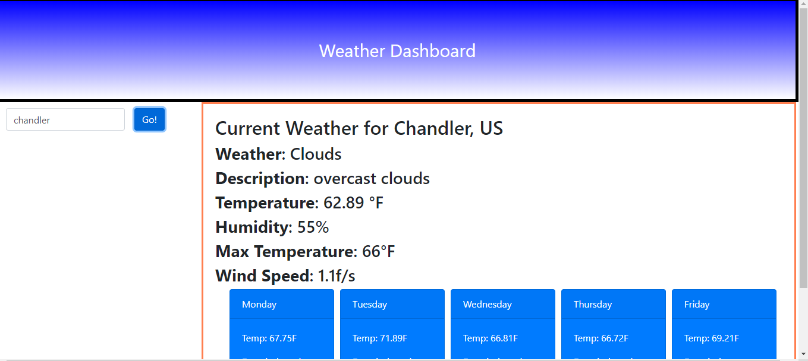

# weather-tracker
The weather tracker uses 3 different APIs to collect the weather from the users selected City.
The Dashboard uses openweathermaps APIs to collect the weather of the current location, as well as the 5 day forcast, and the UV index.

The dashboard uses local storage to append the last searched item from the user

https://jacksoncroy.github.io/weather-tracker/